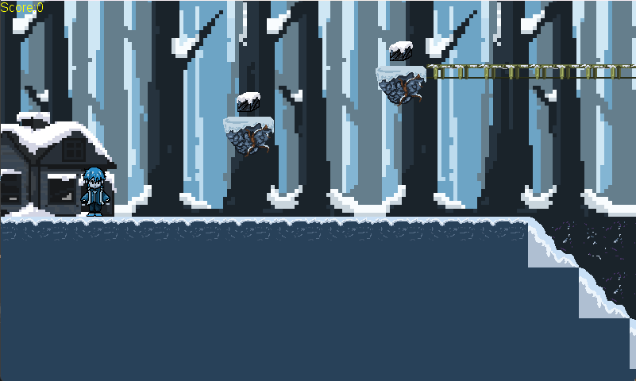

# GhostsOfThePast
## Trabalho 2 - Técnicas de Desenvolvimento de VideoJogos
### Repositório do segundo trabalho de TDVJ

Jogo criado usando a framework do MonoGame.

Realizado por: Diana Silva 29625 e Lucas Alves 27922

Linguagem de escolha: C#

Framework: MonoGame

### Breve descrição:
Encontra os teleportes e acompanha o Spiky numa viagem pelas estações. Mata inimigos e coleta artifactos de forma a obteres o score necessário para o Spiky poder avançar de nível e descobrir os segredos do tempo.

### Preview:




# Análise do Projeto "Ghosts of the Past":

<p style="text-align: justify;">
	
  Como o nome indica, é um projeto que envolve criação de um jogo inspirado em Super Mario em C# junto com a framework do MonoGame. O projeto encontra-se de momento funcional, detendo neste momento funções para detetar colisões, permitir salto, movimento e ataque, bem como o teleporte usando os portais em jogo. Não só, incluímos também um game manager de forma a poder mudar entre os game states(main menu, levels, etc.). O jogo encontra-se preparado para receber mais níveis apesar de apenas existir um.

</p>


# Observações / Explicações / Comentários ao código


## Content folder:

Todos os pngs precisos para o jogo, incluindo os tilesets usados, os pngs do player e as fontes utilizadas no jogo. Contém adicionalmente um folder chamado audio que contém as músicas usadas.

## Interface folder:

### IGameState.cs ###

Cria uma interface com as funções essenciais para cada estado de jogo, que é depois inherited pelas outras classes. 

```ruby	
	void Initialize();
       	void LoadContent(ContentManager content, SpriteBatch spriteBatch);
        void Update(GameTime gameTime, GraphicsDevice graphicsDevice, GraphicsDeviceManager graphicsDeviceManager);
        void Draw(GameTime gameTime, SpriteBatch spriteBatch);
```

### StateManager.cs ###

Estabelece um State Manager que permite mudar entre o main menu, levels, end screen etc.. Dentro do State Manager cada função chama a correspondente ao estado em que o jogo se encontra.

```ruby
	public IGameState CurrentState
        {
            get { return _currentState; }
        }

        public void ChangeState(IGameState newState)
        {
            _currentState = newState;
        }

        public void Initialize()
        {
            _currentState.Initialize();
        }
```
## Data folder(does not show up on GitHub): ##

Contém os .csv que são usados para dar Load do nível e colisões. Este ficheiros .csv foram feitos com recurso a um programa chamado Tiled, que permite a criação/utilização de tilesets criados a partir de pngs. Funciona através da atribuição de um número a uma localização, número esse que corresponde a uma tile no tileset.

## Outside of Folders: ##

### Game1.cs ####

   Default file do MonoGame. Aqui inicializamos todos os files a serem usados e é aqui que o State Manager muda entre o Main Menu e o nível.

### levels.cs ####

   Ficheiro que contém tudo o que é necessário para o nível funcionar. Isto inclui, então, o Load das texturas/tilesets e dos .csv files. O programa dá load e lê os mesmos através da utilização de vários dicionários (de uma maneira geral, um para cada layer, ou um para cada .csv). O ficheiro .csv é lido, com recurso a uma função, que dá parse dos valores e utiliza uma virgula para os delimitar, se o número for maior que -1, ou seja, a posição não está vazia, é então adicionado ao dicionário o valor lido, sendo este o item e o vector 2(posição) que é a key.

```ruby
	private Dictionary<Vector2, int> LoadMap(string filepath)
        {
            Dictionary<Vector2, int> result = new();
            StreamReader reader = new(filepath);

            int y = 0;
            string line;
            while ((line = reader.ReadLine()) != null)
            {
                string[] items = line.Split(',');
                for (int x = 0; x < items.Length; x++)
                {
                    if (int.TryParse(items[x], out int value))
                    {
                        if (value > -1)
                        {
                            result[new Vector2(x, y)] = value;
                        }
                    }
                }
                y++;
            }
            return result;
        }
```
  As colisões são detetadas com recurso ao collisions.csv e aos dicionários criados. Isto é feito a partir da verificação da interseção entre o retângulo do player com a tile de colisão. Existem 2 funções responsáveis pela deteção: public List<Rectangle> getIntersectingTilesHorizontal(Rectangle target), public List<Rectangle> getIntersectingTilesVertical(Rectangle target). 

```ruby

  public List<Rectangle> getIntersectingTilesVertical(Rectangle target)
        {

            List<Rectangle> vertical_intersections = new();

            int widthInTiles = (target.Width - (target.Width % TILESIZE)) / TILESIZE;
            int heightInTiles = (target.Height - (target.Height % TILESIZE)) / TILESIZE;

            for (int x = 0; x <= widthInTiles; x++)
            {
                for (int y = 0; y <= heightInTiles; y++)
                {

                    vertical_intersections.Add(new Rectangle(

                        (target.X + x * (TILESIZE - 1)) / display_tilesize,
                        (target.Y + y * TILESIZE) / display_tilesize,
                        display_tilesize,
                        display_tilesize

                    ));

                }
            }

            return vertical_intersections;
        }
```
  Dentro da função update é depois verificado se alguma das tiles encontradas na função anteriormente mencionada corresponde a uma colisão no collisions.csv e no sidecollisions.csv, então, criamos um retângulo temporário para servir de obstáculo e paramos o movimento do player nessa direção.

```ruby
  if (collisions.TryGetValue(new Vector2(rect.X, rect.Y), out int _val))
                {
                    Rectangle collision = new Rectangle(
                        rect.X * TILESIZE,
                        rect.Y * TILESIZE,
                        TILESIZE,
                        TILESIZE
                    );
                    System.Diagnostics.Debug.WriteLine("intersecting vertically" + rect);
                    ischaronGround = true;

                    if (player.velocity.Y > 0.0f)
                    {
                        player.playerRectangle.Y = collision.Top - player.playerRectangle.Height;
                    }
                    else if (player.velocity.Y < 0.0f)
                    {
                        player.playerRectangle.Y = collision.Bottom;
                    }
```

  É ainda na função update que definimos a câmara para seguir o movimento do player. Para tal utilizamos uma nugget package chamada MonoGame Extended, o que nos permitiu utilizar a OrthographicCamera. Quando o level é iniciado, o Vector2(0,0) é o canto superior esquerdo do mapa, assim apenas verificamos se o player esta muito perto dos limites do mapa e limitamos através de contas matemáticas com o playerRectangle e o tamanho da janela, escolhendo um ponto especifico para a câmara se centrar em vez do player. Também limitamos o Y se o player descer ou subir muito no mapa.

  Já na função Draw, é onde desenhamos todas as tiles do nível, incluindo a tile do player e as tiles dos inimigos. Uma particularidade disto é como utilizamos .csv files tivemos de utilizar um foreach para cada layer. De forma a desenhar era necessário, para cada item no dicionário, aceder ao valor, utilizando o Vector2(x, y) como key. O destination rectangle serve para posicionar as tiles no ecrã, enquanto o source rectangle vai representar a área da tileset que deverá ser desenhada.
  
```ruby
  foreach (var item in platforms)
                {
                    Rectangle drect = new(
                        (int)item.Key.X * display_tilesize, (int)item.Key.Y * display_tilesize, display_tilesize, display_tilesize
                     );

                    int x = item.Value % num_tiles_per_row_png;
                    int y = item.Value / num_tiles_per_row_png;

                    Rectangle src = new(
                        x * tilesize, y * tilesize, tilesize, tilesize
                        );
                    _spriteBatch.Draw(textureDic, drect, src, Color.White);
                }
```
Existe ainda uma função chamada reset, que serve para reiniciar todos os objetos em jogo após a morte do jogador, esta é triggered quando passamos do deathscreen de volta para o level.cs.

```ruby
 if (_stateManager.CurrentState == _deathscreen && Keyboard.GetState().IsKeyDown(Keys.Enter))
        {
            _levels.Reset();
            _stateManager.ChangeState(_levels);
            LoadContent();
        }
```
### Player.cs ###

  Na player class inicializamos todos os atributos do player, lidamos com o movimento, incluindo o salto, com o ataque, a vida e mana. É ainda nesta classe que lidamos com as animações e definimos a velocidade das mesmas.

### Enemies.cs ###

A class dos inimigos funciona como uma player class, com a excepção de que eles se movem sozinhos e sempre que existe uma colisão entre o inimigo e o mapa a velocidade é invertida.

### Deathscreen.cs ###

A deathscreen é triggered quando o player morre, permitindo ao jogador carregar no enter para dar reset ao jogo e tentar outra vez.
